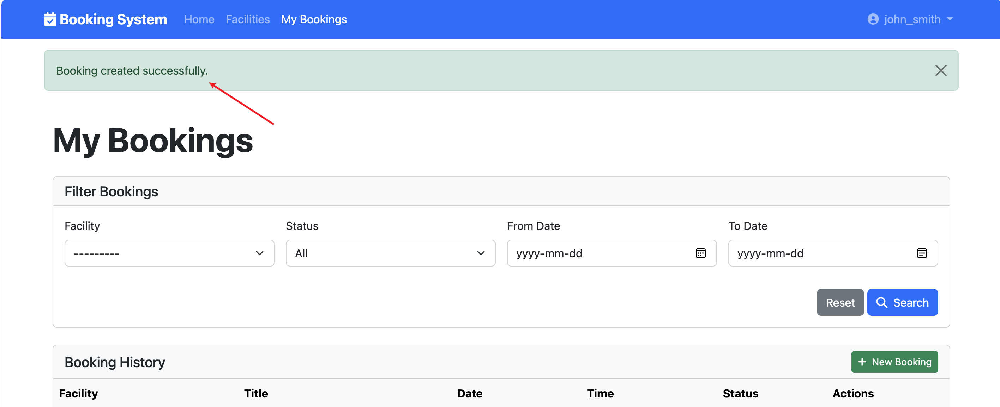
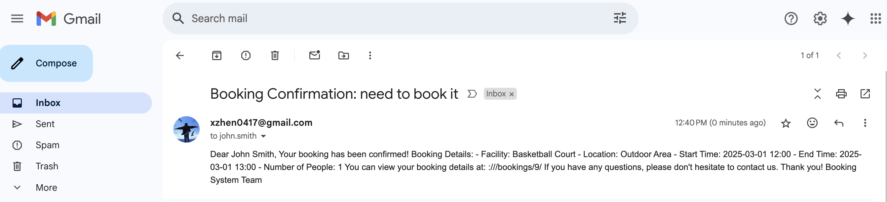
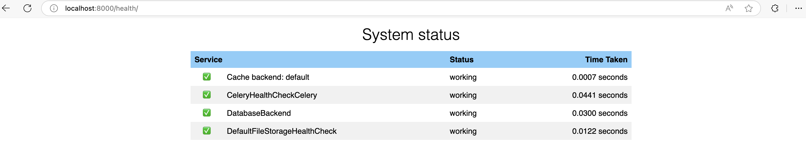

# Mini Booking System

A Django application for a simple booking system where users can book available slots for a facility.

## Project Overview

The Mini Booking System is a comprehensive facility booking platform built with Django. It enables users to register, browse available facilities, make bookings, and manage their reservations. The application is fully containerized for easy deployment and includes background task processing for email notifications.

## Architecture

The project follows a modular architecture with the following components:

### Core Components

- **Django Backend** - Handles all business logic, user authentication, and database operations
- **PostgreSQL Database** - Stores all application data with optimized indexes and constraints
- **Redis** - Used as a message broker for Celery tasks
- **Celery** - Processes background tasks like sending notification emails
- **Nginx** - Serves static files and handles HTTP requests (in production)

### Application Structure

```
booking/
├── booking/              # Main Django project
│   ├── apps/             # Django applications
│   │   ├── accounts/     # User management
│   │   ├── bookings/     # Booking functionality
│   │   ├── core/         # Core functionality
│   │   └── facilities/   # Facility management
│   ├── settings/         # Project settings
│   ├── static/           # Static assets
│   └── templates/        # HTML templates
├── docker/               # Docker configuration
├── staticfiles/          # Collected static files
├── .env                  # Environment variables
├── docker-compose.yml    # Docker Compose configuration
├── Dockerfile            # Docker build instructions
└── requirements.txt      # Python dependencies
```

## Installation & Setup

### Prerequisites

- Docker and Docker Compose
- Git

### Quick Start

1. Clone the repository:

   ```bash
   git clone <repository-url>
   cd booking
   ```

2. Execute the `init_project.sh` script to initialize the Docker deployment:

```shell
chmod 777 init_project.sh
./init_project.sh
```

3. Execute the `insert_data.sh` script to load the data:

```
chmod 777 insert_data.sh
./insert_data.sh
```

4. Access the application at `http://localhost:8000`

## Development Environment

### Local Development

1. Build and start the development containers:

   ```bash
   docker-compose up -d --build
   ```

2. Access the development server at `http://localhost:8000`

3. View logs:

   ```bash
   docker-compose logs -f web
   ```

### Executing Commands

Execute Django management commands inside the container:

```bash
docker-compose exec web python manage.py <command>
```

For example:

```bash
docker-compose exec web python manage.py createsuperuser
```

## Testing

The application includes comprehensive tests for models, forms, and views. Test cases ensure that:

- Data models work correctly
- Forms validate properly
- Views render the expected templates
- Authentication and permissions work as intended
- Business logic rules are enforced

### Running Tests

Run all tests:

```bash
docker-compose exec web python manage.py test
```

Run specific app tests:

```bash
docker-compose exec web python manage.py test booking.apps.bookings
```

Or with pytest:

```bash
docker-compose exec web pytest
```

With coverage report:

```bash
docker-compose exec web pytest --cov=booking
```

##  Database Optimization

The database schema is optimized in several ways:

### Indexes

The application uses strategic indexes to improve query performance:

- **Booking Model**: Indexes on `user`, `facility`, `status`, and a composite index on `start_time` and `end_time` fields
- **Facility Model**: Indexes on `name`, `is_active`, and `location` fields

### Constraints

Database constraints help maintain data integrity:

- Check constraint to ensure `end_time` is always greater than `start_time`
- Foreign key constraints with appropriate cascade behavior

### Query Optimizations

- `select_related` and `prefetch_related` are used to reduce database queries
- Celery tasks handle heavy operations asynchronously
- Pagination is implemented for list views

## Key Design Decisions

### Authentication System

- Custom User model extending Django's AbstractUser, allowing for additional fields like phone number and address
- Standard Django authentication views for login, logout, password reset

### Booking System

- Class-based views for consistent pattern implementation
- Permission-based access control (users can only view/modify their own bookings)
- Validation for booking time conflicts and capacity limits

### UI/UX

- Bootstrap 5 for responsive, mobile-friendly design
- Form validation feedback
- Django messages for user notifications
- Clean, intuitive interface

### Performance & Scalability

- Background task processing with Celery for email notifications
- Docker containerization for easy scaling
- Health checks for monitoring application status

## Administrative Interface

The Django admin interface is customized for easier management:

1. Access the admin interface at `http://localhost:8000/admin`
2. Default admin credentials (if using the initialization script):
   - Username: `admin`
   - Password: `admin`
3. Users' credentials:

| Username      | Email                     | Password    |
| ------------- | ------------------------- | ----------- |
| john_smith    | john.smith@example.com    | password123 |
| sarah_johnson | sarah.johnson@example.com | password123 |
| michael_brown | michael.brown@example.com | password123 |
| emily_davis   | emily.davis@example.com   | password123 |
| david_wilson  | david.wilson@example.com  | password123 |

## API Endpoints

### Health Check

- `GET /health/` - Check application health status

### Authentication

- `GET /accounts/login/` - User login
- `GET /accounts/logout/` - User logout
- `GET /accounts/password_reset/` - Password reset

### Facilities

- `GET /facilities/` - List all facilities
- `GET /facilities/<id>/` - View facility details

### Bookings

- `GET /bookings/` - List user's bookings
- `GET /bookings/<id>/` - View booking details
- `GET /bookings/create/` - Create a new booking
- `GET /bookings/<id>/update/` - Update an existing booking
- `GET /bookings/<id>/delete/` - Delete a booking

## Welcome page


## Login Successfully


## User Profile


## User Information Edit


## Facilities Search


## AJAX for Asynchronous Booking



## Booking Information


## Celery for Background Tasks




## Health Check Endpoint for Docker container monitoring




## Future Improvements

Potential areas for enhancement:

- Add WebSocket support for real-time updates
- Implement a REST API for mobile application support
- Add a calendar view for facility availability
- Implement recurring bookings
- Add multi-language support